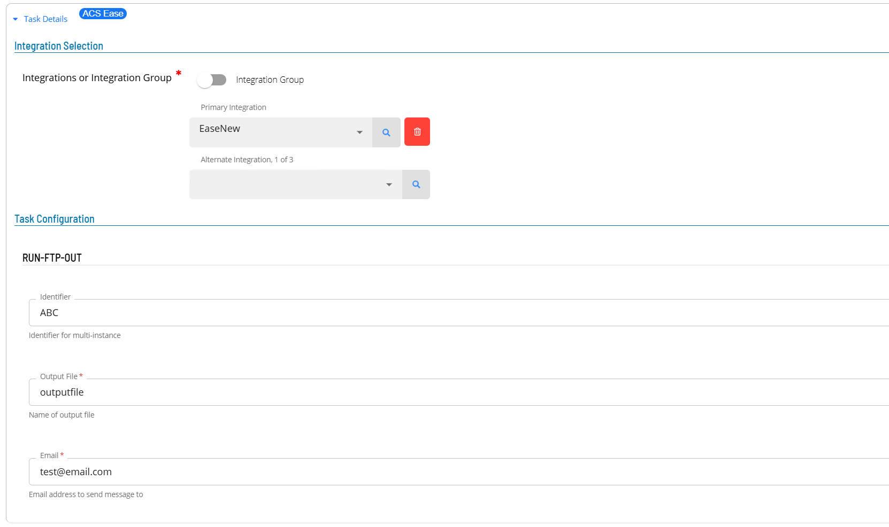
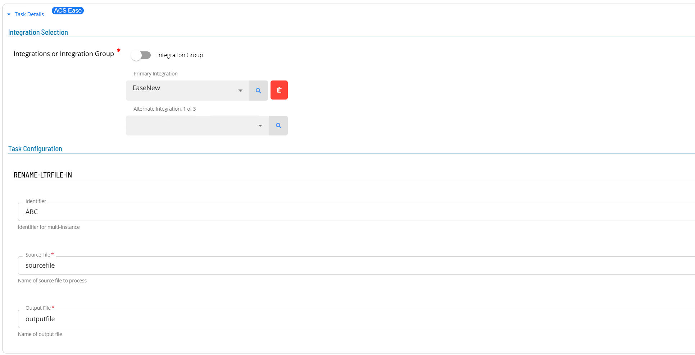
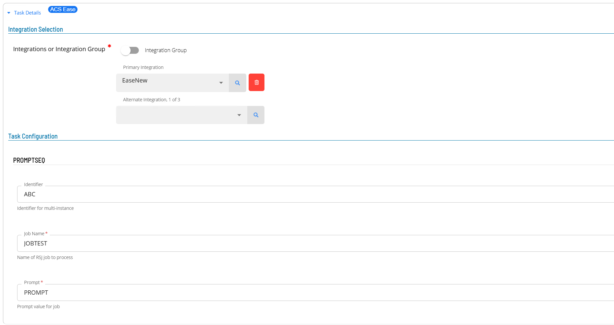
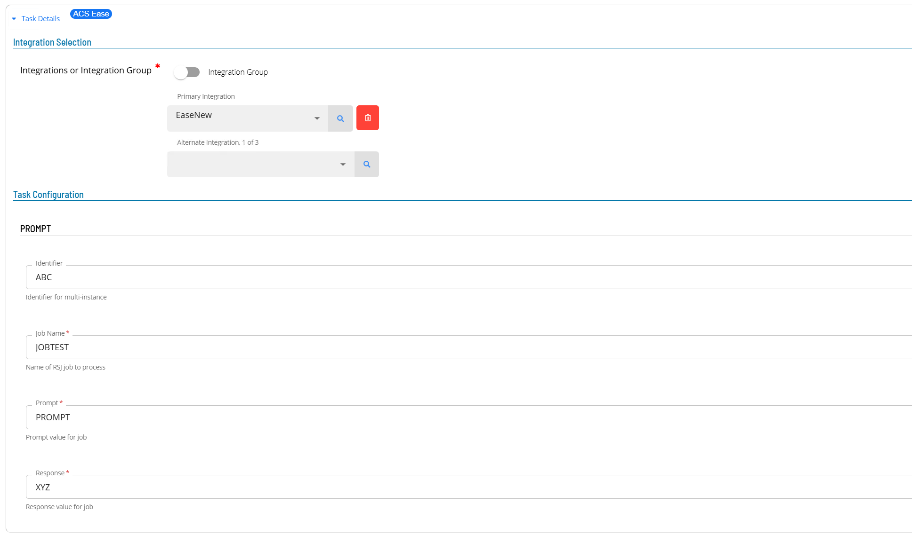
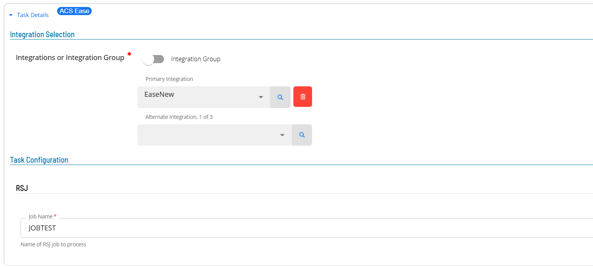

# ACSEase Operation

Once the sma.acs.ACSEase plugin has been registered with the OpCon system, it will be possible to perform agent and task definitions.
All definitions can only be performed using Solution Manager.

## Defining ACSEase connection

The Agent definition is define the connection between your local OpCon system and the target Ease DataCenter OpCon system. 
This is done by adding a new ACSease Agent definition using Solution Manager. 

Items defined in red are required values (note : global properties are supported). 

1.  Open Solution Manager.
2.  From the Home page select **Library**
3.  From the ***Administration*** Menu select **Agents**.
4.  Select **+Add** to add a new agent definition.
5.  Fill in the agent details
    - Insert a unique name for the connection.
    - Select **ACSEase** from the **Type** drop-down list.
    - Select **General Settings**
    - Check that the NetCom Name is set to **Default** or the SMA Relay name if Relay is being used. 
    - Select **ACSEase Settings**
    - In the **Customer Id** field enter customer number provided by the Ease DataCenter.
    - In the **Retain Log Files** field enter a value defining the number of days to retain log files (default is 30 days).
    - In the **Ease DataCenter** section
        - In the **Ease URL** filed enter the host and port number provided by the Ease DataCenter (host:port).
        - In the **Ease User** field enter the user name provided by the Ease DataCenter.
        - In the **Ease User Password** filed enter the password associated with the provided Ease User.  
6.  Save the definition changes. 
7.  Start the connection by selecting the **Change Communication Status** button and selecting **Enable Full Comm.**. 

## Defining tasks

The ACSEase Connection supports the following task types:

Task Type                | Description
-------------------------|-------------------------------------
COPY-RENAME-LTRFILE-OUT  | Copy or Rename Letter File for FTP
COPY-RPT-OUT             | Copy Report to Letter Files for FTP
RUN-FTP-OUT              | FTP Letter File off Symitar      
RENAME-LTRFILE-IN        | Rename Letter File Removing Prefix   
MONITOR                  | File Monitor for Incoming File       
PROMPTSEQ                | Answer a Single Prompt with a SEQ    
PROMPT                   | Answer a Single Prompt               
RESET                    | Reset a Single Prompt                
RSJ                      | Run Symitar Job (single-threaded)    
RSJMULTI                 | Run Symitar Job (multi-threaded)     
RSJEDIT                  | Runs Symitar Job with Edit File      
SEQ                      | Collect the SEQ of a Report   

Defining tasks only requires providing the values associated with the specific task. It is possible to use global properties when defining
tasks.

### COPY-RENAME-LTRFILE-OUT Task

1.  Open Solution Manager.
2.  From the Home page select **Library**
3.  From the ***Administration*** Menu select **Master Jobs**.
4.  Select **+Add** to add a new master job definition.
5.  Fill in the task details.
    - Select the **Schedule** name from the drop-down list.
    - In the **Name** field enter a unique name for the task within the schedule.
    - Select **ACSEase** from the **Job Type** drop-down list.
    - Select **COPY-RENAME-LTRFILE-OUT : Copy or Rename Letter File for FTP** from the **Task Type** drop-down list.
    
Enter details for Task Type **COPY-RENAME-LTRFILE-OUT**. 

1.  Select the **Task Details** button.
2.  In the **Integration Selection** section, select the primary integration which is an ACSEase connection previously defined.
3.  In the **TaskConfiguration** section
    - In the **Identifier** field enter a unique identifier for the task.
    - select an Action from the **Action** drop-down list.
    - In the **Source File** field enter the source file name associated with the task.
    - In the **Output File** field enter the output file name associated with the task.
4.  Save the definition changes. 

### COPY-RPT-OUT Task

1.  Open Solution Manager.
2.  From the Home page select **Library**
3.  From the ***Administration*** Menu select **Master Jobs**.
4.  Select **+Add** to add a new master job definition.
5.  Fill in the task details.
    - Select the **Schedule** name from the drop-down list.
    - In the **Name** field enter a unique name for the task within the schedule.
    - Select **ACSEase** from the **Job Type** drop-down list.
    - Select **COPY-RPT-OUT : Copy Report to Letter Files for FTP** from the **Task Type** drop-down list.
    
Enter details for Task Type **COPY-RPT-OUT**. 

1.  Select the **Task Details** button.
2.  In the **Integration Selection** section, select the primary integration which is an ACSEase connection previously defined.
3.  In the **TaskConfiguration** section
    - In the **Identifier** field enter a unique identifier for the task.
    - In the **Output File** field enter the output file name associated with the task.
4.  Save the definition changes. 

### RUN-FTP-OUT Task

1.  Open Solution Manager.
2.  From the Home page select **Library**
3.  From the ***Administration*** Menu select **Master Jobs**.
4.  Select **+Add** to add a new master job definition.
5.  Fill in the task details.
    - Select the **Schedule** name from the drop-down list.
    - In the **Name** field enter a unique name for the task within the schedule.
    - Select **ACSEase** from the **Job Type** drop-down list.
    - Select **RUN-FTP-OUT : FTP Letter File off Symitar** from the **Task Type** drop-down list.
    
Enter details for Task Type **RUN-FTP-OUT**. 

1.  Select the **Task Details** button.
2.  In the **Integration Selection** section, select the primary integration which is an ACSEase connection previously defined.
3.  In the **TaskConfiguration** section
    - In the **Identifier** field enter a unique identifier for the task.
    - In the **Output File** field enter the output file name associated with the task.
    - In the **Email** field enter an email address that will receive notification when the transfer is complete.
4.  Save the definition changes. 

### RENAME-LTRFILE-IN Task

1.  Open Solution Manager.
2.  From the Home page select **Library**
3.  From the ***Administration*** Menu select **Master Jobs**.
4.  Select **+Add** to add a new master job definition.
5.  Fill in the task details.
    - Select the **Schedule** name from the drop-down list.
    - In the **Name** field enter a unique name for the task within the schedule.
    - Select **ACSEase** from the **Job Type** drop-down list.
    - Select **RENAME-LTRFILE-IN : Rename Letter File Removing Prefix** from the **Task Type** drop-down list.
    
Enter details for Task Type **RENAME-LTRFILE-IN**. 

1.  Select the **Task Details** button.
2.  In the **Integration Selection** section, select the primary integration which is an ACSEase connection previously defined.
3.  In the **TaskConfiguration** section
    - In the **Identifier** field enter a unique identifier for the task.
    - select an Action from the **Action** drop-down list.
    - In the **Source File** field enter the source file name associated with the task.
    - In the **Output File** field enter the output file name associated with the task.
4.  Save the definition changes. 

### MONITOR Task

1.  Open Solution Manager.
2.  From the Home page select **Library**
3.  From the ***Administration*** Menu select **Master Jobs**.
4.  Select **+Add** to add a new master job definition.
5.  Fill in the task details.
    - Select the **Schedule** name from the drop-down list.
    - In the **Name** field enter a unique name for the task within the schedule.
    - Select **ACSEase** from the **Job Type** drop-down list.
    - Select **MONITOR : File Monitor for Incoming File** from the **Task Type** drop-down list.
    
Enter details for Task Type **MONITOR**. 

1.  Select the **Task Details** button.
2.  In the **Integration Selection** section, select the primary integration which is an ACSEase connection previously defined.
3.  In the **TaskConfiguration** section
    - In the **Identifier** field enter a unique identifier for the task.
    - In the **File** field enter the monitor file name associated with the task.
4.  Save the definition changes. 

### PROMPTSEQ Task

1.  Open Solution Manager.
2.  From the Home page select **Library**
3.  From the ***Administration*** Menu select **Master Jobs**.
4.  Select **+Add** to add a new master job definition.
5.  Fill in the task details.
    - Select the **Schedule** name from the drop-down list.
    - In the **Name** field enter a unique name for the task within the schedule.
    - Select **ACSEase** from the **Job Type** drop-down list.
    - Select **PROMPTSEQ : Answer a Single Prompt with a SEQ** from the **Task Type** drop-down list.
    
Enter details for Task Type **PROMPTSEQ**. 

1.  Select the **Task Details** button.
2.  In the **Integration Selection** section, select the primary integration which is an ACSEase connection previously defined.
3.  In the **TaskConfiguration** section
    - In the **Identifier** field enter a unique identifier for the task.
    - In the **Job Name** field enter the the name of the RSJ job associated with this request.
    - In the **Prompt** field enter prompt to submit.
4.  Save the definition changes. 

### PROMPT Task

1.  Open Solution Manager.
2.  From the Home page select **Library**
3.  From the ***Administration*** Menu select **Master Jobs**.
4.  Select **+Add** to add a new master job definition.
5.  Fill in the task details.
    - Select the **Schedule** name from the drop-down list.
    - In the **Name** field enter a unique name for the task within the schedule.
    - Select **ACSEase** from the **Job Type** drop-down list.
    - Select **PROMPT : Answer a Single Prompt** from the **Task Type** drop-down list.
    
Enter details for Task Type **PROMPT**. 

1.  Select the **Task Details** button.
2.  In the **Integration Selection** section, select the primary integration which is an ACSEase connection previously defined.
3.  In the **TaskConfiguration** section
    - In the **Identifier** field enter a unique identifier for the task.
    - In the **Job Name** field enter the the name of the RSJ job associated with this request.
    - In the **Prompt** field enter prompt.
    - In the **Response** field enter the response to the associated prompt.
4.  Save the definition changes. 

### PROMPT Task

1.  Open Solution Manager.
2.  From the Home page select **Library**
3.  From the ***Administration*** Menu select **Master Jobs**.
4.  Select **+Add** to add a new master job definition.
5.  Fill in the task details.
    - Select the **Schedule** name from the drop-down list.
    - In the **Name** field enter a unique name for the task within the schedule.
    - Select **ACSEase** from the **Job Type** drop-down list.
    - Select **RSJ : Run Symitar Job (single-threaded)** from the **Task Type** drop-down list.
    
Enter details for Task Type **RSJ**. 

1.  Select the **Task Details** button.
2.  In the **Integration Selection** section, select the primary integration which is an ACSEase connection previously defined.
3.  In the **TaskConfiguration** section
    - In the **Job Name** field enter the the name of the RSJ job associated with this request.
4.  Save the definition changes. 

### RSJMULTI Task

1.  Open Solution Manager.
2.  From the Home page select **Library**
3.  From the ***Administration*** Menu select **Master Jobs**.
4.  Select **+Add** to add a new master job definition.
5.  Fill in the task details.
    - Select the **Schedule** name from the drop-down list.
    - In the **Name** field enter a unique name for the task within the schedule.
    - Select **ACSEase** from the **Job Type** drop-down list.
    - Select **RSJMULTI : Run Symitar Job (multi-threaded)** from the **Task Type** drop-down list.
    
Enter details for Task Type **RSJMULTI**. 

1.  Select the **Task Details** button.
2.  In the **Integration Selection** section, select the primary integration which is an ACSEase connection previously defined.
3.  In the **TaskConfiguration** section
    - In the **Identifier** field enter a unique identifier for the task.
    - In the **Job Name** field enter the the name of the RSJ job associated with this request.
4.  Save the definition changes. 

### RSJEDIT Task

1.  Open Solution Manager.
2.  From the Home page select **Library**
3.  From the ***Administration*** Menu select **Master Jobs**.
4.  Select **+Add** to add a new master job definition.
5.  Fill in the task details.
    - Select the **Schedule** name from the drop-down list.
    - In the **Name** field enter a unique name for the task within the schedule.
    - Select **ACSEase** from the **Job Type** drop-down list.
    - Select **RSJEDIT :Runs Symitar Job with Edit File** from the **Task Type** drop-down list.
    
Enter details for Task Type **RSJEDIT**. 

1.  Select the **Task Details** button.
2.  In the **Integration Selection** section, select the primary integration which is an ACSEase connection previously defined.
3.  In the **TaskConfiguration** section
    - In the **Identifier** field enter a unique identifier for the task.
    - In the **Job Name** field enter the the name of the RSJ job associated with this request.
    - In the **Edit File** field enter the edit file name associated with the task.
4.  Save the definition changes. 

### SEQ Task

1.  Open Solution Manager.
2.  From the Home page select **Library**
3.  From the ***Administration*** Menu select **Master Jobs**.
4.  Select **+Add** to add a new master job definition.
5.  Fill in the task details.
    - Select the **Schedule** name from the drop-down list.
    - In the **Name** field enter a unique name for the task within the schedule.
    - Select **ACSEase** from the **Job Type** drop-down list.
    - Select **SEQ : Collect the SEQ of a Report** from the **Task Type** drop-down list.
    
Enter details for Task Type **SEQ**. 

1.  Select the **Task Details** button.
2.  In the **Integration Selection** section, select the primary integration which is an ACSEase connection previously defined.
3.  In the **TaskConfiguration** section
    - In the **Identifier** field enter a unique identifier for the task.
    - In the **Job Name** field enter the the name of the RSJ job associated with this request.
    - In the **Report Name** field enter the report name associated with the task.
4.  Save the definition changes. 
      
   
