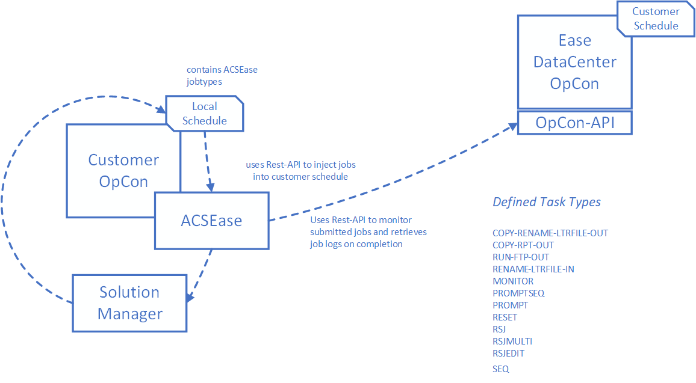

Latest version is 25.0.0

Ease ACS provides direct Rest-API access to applications without the need for the installation of additional components.
It is part of the ACS (Agentless Connector System) suite of products. 

ACS is a new OpCon Agent type that provides a framework for agent development. It is an internal component provided by the SMANetCom module. 
All integrations are generated DLL's and placed in a standard folder that is monitored by the ACS services.

These modules are loaded into the OpCon environment during startup. New modules can be copied to the monitored folder and will be available for 
configuration after the SMA OpCOn Service Manager and SMA OpCon RestAPI services are restarted.

All code and task / agent screen definitions are contained in the generated DLL that is placed in the monitored folder. To display the task and 
agent definitions, the form layouts are retrieved from the DLL and passed to Solution Manager to render the screen layout. Agent / task definitions are 
stored as JSON values in the OpCon database tables.

Agent / task definitions for the ACS environment can only be created / updated using Solution Manager.
JORS support for the ACS environment is only provided through Solution Manager.

## Implementation

Ease ACS comprises of the ACS Ease environment which is a set of plugins that are copied to the ..\OpConxps\SAM\plugins folder of an on-prem
OpCon environment or the ..\SAMRelay\plugins folder of a on-prem SMA Relay installation.

The ACS Ease module provides the various screen definitions and execution code to manage ACS Ease task types. Solution Manager is used to define the
connection to the Ease DataCenter OpCon system as well as ACSEase task types which are stored in a schedule in the customer OpCon system.

During task execution, the ACSEase task on the customer OpCon system uses the OpCon Rest-API capabilities to inject tasks into their defined schedule in the Ease DataCenter OpCon system. The submitted tasks are monitored for completion and when complete, the job logs of the Ease DataCenter task are retrieved and appended to the job log of the customer ACSEase task.

## ACS Ease

The connection information is entered when defining the ACSEase Connection. Each connection is a associated with a target schedule in the Ease DataCenter. Therefore if multiple target schedules are required, multiple ACSEase connections will be required.

The implementation includes the retrieval of the job logs of the Tasks executing in the Ease DataCenter and appending the information to the local job log. This means that it is not necessary to access the Ease DataCenter environment to view job logs.

The following connection information is required:

Information           | Description
----------------------|------------------------------------------------
Customer Id           | The customer Id allocated by the Ease Datacenter.
Ease Schedule Name    | The schedule name allocated by the Ease Datacenter.
Ease URL              | The url provided by the Ease Datacenter to access the target OpCon rest-API.
Ease User             | The Ease user allocated by the Ease Datacenter.
Ease User Password    | The password of the allocated Ease user. 

Provides the following task types.

Task Type                | Description
-------------------------|-------------------------------------
COPY-DATA-TO-LTRFILE     | Copy outgoing Data File to Letter Files for FTP
COPY-RENAME-LTRFILE-OUT  | Copy or Rename Letter File for FTP
COPY-RPT-OUT             | Copy Report to Letter Files for FTP
FILEPERMS                | Update Letter File Privileges to 774
MONITOR                  | File Monitor for Incoming File       
MOVE-LTRFILE-TO-DATA     | Move incoming Letter File to Data Files
PROMPT                   | Answer a Single Prompt               
PROMPTSEQ                | Answer a Single Prompt with a SEQ    
RUN-FTP-OUT              | FTP Letter File off Symitar      
RENAME-LTRFILE-IN        | Rename Letter File Removing Prefix   
RESET                    | Reset a Single Prompt                
RSJ                      | Run Symitar Job (single-threaded)    
RSJEDIT                  | Runs Symitar Job with Edit File      
RSJMULTI                 | Run Symitar Job (multi-threaded)     
SEQ                      | Collect the SEQ of a Report  
SEQ-SEND                 | Copy Specified SEQ to Reports for FTP
TRANSLATE2COMMAS         | Answer a Single Prompt containing commas

